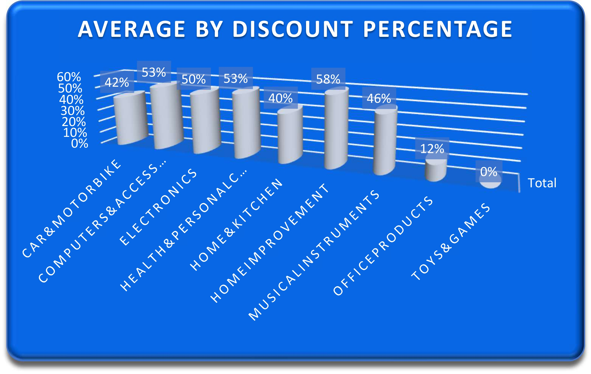
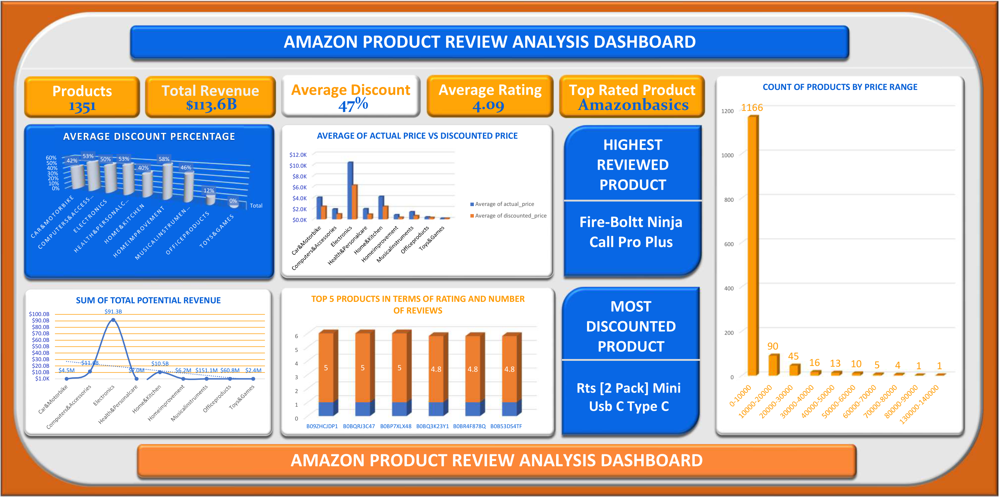

#  Amazon Product Review Analysis  
A case study built with Excel to analyze Amazon product listings, uncovering insights on discounts, ratings, reviews, and potential revenue. Features include a clean dashboard, pivot tables, and visual charts to support business decision making.
### Case Study by Olababs The Analyst

---

##  Project Overview

**Objective:**  
To analyze Amazon product data to uncover insights on `discount strategies`,  `customer satisfaction`,  and `potential revenue`   across categories.

**Tools Used:**  
 - `Microsoft Excel`
 - `Pivot Tables & Charts`  
 - `Data Cleaning (Basic Functions, Sorting, Filtering)`

---

##  Key Business Questions Answered

1.  **Which categories offer the highest average discount?**  
   - **Home Improvement** offered the highest discount .

2.  **What’s the relationship between rating and level of discount?**  
   - The correlation bewteen rating and level of discount is -0.16. i.e As discount increases, rating tend to decrease, but weakly.

3.  **Which products generate the highest potential revenue?**  
   - **Fire-Boltt Ninja Call Pro Plus Smart Watch** dominate with high review counts and pricing contributing significantly to **$113.1B** in total potential revenue.  

4.  **Which products are top-rated?**  
   - *Answer:* Products such as `Amazon Basics Wireless Mouse`, `Redtech Usb-C To Lightning Cable` and `Syncwire Ltg To Usb Cable` have perfect **5.0 ratings**.

5.  **How are products priced across buckets?**  
   - *Answer:* Majority of products (**1166 out of 1351**) fall under the ₹0–₹10,000 price bucket.  

---

##  Visual Insights
---

-  **Average Discount % by Category**  
  

-  **Average of Actual vs Discounted Price**  
  

-  **Top 5 Highest Rated Products**  
  

-  **Most Reviewed Product**  
  - **Fire-Boltt Ninja Call Pro Plus Smart Watch**  

-  **Potential Revenue by Category**  
  
  
-  **Product Count by Price Range**  
  

---

##  Insights & Takeaways

-  The total potential revenue exceeded **$113.1B**, with most coming from a handful of high-performing categories.
-  **Fire-Boltt Smart Watch** had the **highest number of reviews** and strong ratings, making it a top performer.
-  Ratings are mostly positive **majority of products fall between 4.0 to 5.0 stars**.
-  Over **50% of products** had discounts of **50% or more**, showing competitive pricing is a major strategy.
-  Affordable products (< ₹10,000) dominate listings, but high ticket items contribute more to total revenue.

---

##  Skills Highlighted

-  Excel (Pivot Tables, Charts, XLOOKUP, Formulas)
-  Data Cleaning & Preprocessing
-  Exploratory Data Analysis (EDA)
-  Dashboard Creation & Business Reporting

---
## Analytics Dashboard
---
 
 
##  Conclusion

This analysis highlighted the power of Excel in generating business ready insights. From identifying top products to understanding how pricing impacts engagement and revenue **even a simple dataset can unlock major growth strategies** when explored correctly.

---

 *Authored by:* **Olababs The Analyst**  
 *Date:* June 2025  
